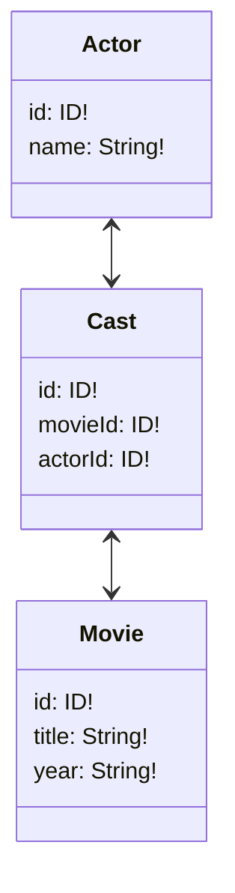
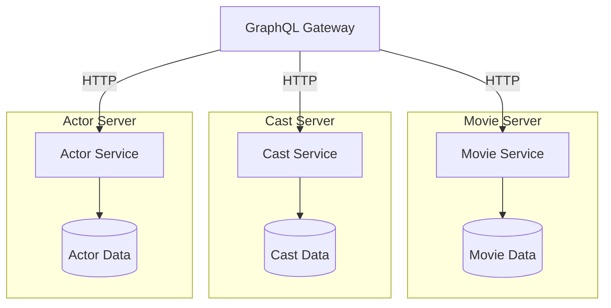
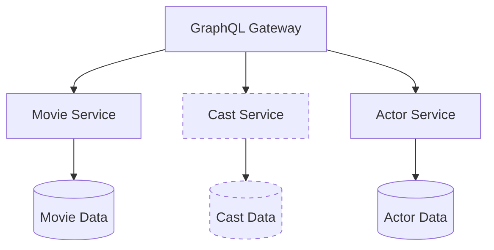

# GraphQL Federation vs Schema Stitching

## Installation

Run

```
npm i
```

from the root folder and within the each of the services folder.

## Run

To run the project in development mode:

```
npm run dev-federated
```

or

```
npm run dev-stitched
```

To run the project in production mode:

```
npm run start-federated
```

or

```
npm run start-stitched
```

## Data Layer

<div style="text-align: center; padding: 20px">



</div>

## Services diagram

<table>
<tr>
<td>
<h3>Federation</h3>
</td>
<td>
<h3>Stitching</h3>
</td>
</tr>
<tr>
  <td style="padding: 12px 2px">



  </td>
  <td style="border-left: 1px dashed; padding: 12px 2px">



  </td>
</tr>

<tr style="text-align: left">
<td style="vertical-align: top">

**Entrypoint**: [./01.federated.gateway.ts]()

> Services are hosted as separate servers each defining their own schema. `Cast Service` schema definition extends both Actor and Movie adding the connection between the two.

**Example**

Query:

```graphql
query {
  actors {
    name
    movies {
      title
      year
    }
  }
}
```

Execution:

1. HTTP request lands on GraphQL Gateway
2. Gateway launches a parallel HTTP request to `Actor Server` and `Cast Server` to fetch all the actors and their corresponding movie connections.
3. `Actor Service` resolves a `name` field from the `Actor` type, `Cast Service` resolves an array of `Movie` types containing only `id`
4. Gateway launches another HTTP request to `Movie Server` to resolve the rest of the fields (`title`, `year` from `Movie` type) requested by the initial HTTP request and invokes `__resolveReference` defined here: [./services/movie/schema.federated.ts#L47]()
5. The final response is then put together and returned from the Gateway

</td>

<td style="vertical-align: top">

**Entrypoint**: [./02.stitched.gateway.ts]()

> Services are part of the main server process. Can be hosted as separate HTTP servers but it's not a neccessity. `Cast Service` is internally added as a subschema into Gateway and is used to resolve the connection between `Movie Service` and `Actor Service` but is not eventually exposed to the final Gateway schema.

**Example**

Query:

```graphql
query {
  actors {
    name
    movies {
      title
      year
    }
  }
}
```

Execution:

1. HTTP request lands on GraphQL Gateway
2. Gateway starts resolving the list of `Actor` types.
3. Once the `movies` field is requested it goes into a special resolver defined during the stitching process over here: [./02.stiched.gateway.ts#L55](). This first delegates the responsibility to resolve actor --> movie connections to the internal `Cast Service`. This is done by invoking an internal `getCastsByActorId` query exposed by the `Cast Service` internally.
4. Once casts containing all the `movieIds` are resolved the special resolver then "batch"-delegates the resolution of the remaining `Movie` type fields to the `Movie Service` - concretely to the `movies` query.
5. The final response is then put together and returned from the Gateway

</td>
</tr>
</table>

---

[GraphQL Federation](https://www.apollographql.com/docs/apollo-server/federation/introduction/) and [Schema Stitching](https://www.apollographql.com/docs/graphql-tools/schema-stitching/) are two ways to build a GraphQL schema from multiple GraphQL services. This document describes the differences between the two techniques.

## Federation

Federation is a specification that describes how to distribute a GraphQL API into multiple distributed subservices. The specification is provided by [Apollo](https://www.apollographql.com/).

### Advantages

- Federation is an official specification
- Federation's Gateway is much easier to get up and running
- Federation allows to develop and deploy separate services completely independently by multiple teams

### Disadvantages

- Federation mandates for each service to be hosted as a separate server process
- Federation introduces new directives that have to be used across services' schema definitions
- Federation doesn't support subscriptions out of the box but there are some hacky solutions
- I wasn't able to find a viable quick way to setup a quick graphQL wrapper over REST API other than setting up a completely new service

## Schema Stitching

Schema Stitching is a technique that describes how to merge multiple GraphQL schemas into one. The technique is provided by [Apollo](https://www.apollographql.com/).

### Advantages

- Schema Stitching does not require exploring new directives outside of official GraphQL language (even though it's optionally available - e.g. `@merge` directive)
- Schema Stitching does not require a separate GraphQL server per service to be running
- Schema Stitching allows separate services to share a single server process
- Schema Stitching enables easy to setup GraphQL wrapper over the REST API
- Schema Stitching supports subscriptions

### Disadvantages

- Schema Stitching comes with a much larger intial boilerplate
- Schema Stitching has a single shared gateway file which needs to be maintained when new connections are introduced which complicates an independent service development
- Schema Stitching is not an official specification

## Conclusion

Federation was much easier to set up and make sense of. It also comes up with quite extensive documentation in oppose to schema stitching. It is a formal specification maintained by Apollo team. Schema stitching on the other hand provides more flexibility in terms of infrastructure set up and addresses a broader variety of problems.

---

> ### What approach would you recommend to use in the next service oriented project and why?
>
> Neither of the above. If my next project was a startup then I'd consider the above methods to be a premature optimization and unnecessary over-engineering.
> If on the other hand my next project would be a long running project that has finances to invest into performance then I would consider much more scalable option of microservices structure like Apache Kafka.
> The only usecase I can imagine me using the Schema Stitching would be a gradual rewrite of an existing application. I would receive requests on a gateway and forward them either to the old codebase or if the part of the system was already rewritten into a new system then I would forward it to the new codebase.
> We've also used Schema Stitching on Coinflip where the core of the system was a GraphQL server written in C# and our new modules and functionalities were built in NodeJS as a separate GraphQL API. A gateway stitched both GraphQL schema built in C# with our GraphQL schema built in NodeJS

---

> ### Can you explain the role of API Gateway in both concepts?
>
> Gateway is the first point of contact from frontend environments. It's exposed to the general public. It's responsible for putting together an execution plan based on the services registered and then distribute the subschema requests to them. After that the responses are combined and returned to the client.

---

> ### Implement one more service that will be using REST and doesn’t provide GraphQL schema itself
>
> The service is located in [./services/rating](). I've also injected it into [./02.stitched.gateway.ts](). I didn't find any information on how to incorporate it into federated gateway other than defining a completely new service.
